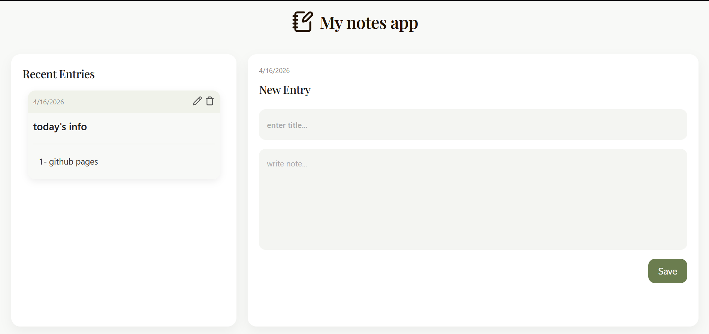

# 📝 Minimal Notes App

A simple and clean notes app built with React, focused on core functionality and a distraction-free experience.

## ✨ Features

* Add new notes
* Edit existing notes
* Delete notes
* Data persistence using localStorage
* Clean and minimal UI

## 🛠️ Tech Stack

* React (Functional Components & Hooks)
* CSS (Custom styling)
* Vite
* localStorage API

## 🎯 Purpose

This project was built to practice React fundamentals while improving UI design skills.

The focus was on:

* Managing state effectively
* Structuring components clearly
* Persisting data on the client side
* Designing a minimal and usable interface

## 🎨 Design

The UI uses a muted olive color palette with a minimal layout to create a calm and focused writing experience.

Typography: Inter + Playfair Display

## 📸 Preview

## 🚧 Challenges

* Managing form behavior (handling Enter key submission correctly)
* Switching between add and edit modes
* Syncing state with localStorage
* Improving UI without overcomplicating the design

## 📈 What I Learned

* How to manage and persist state using localStorage
* Better understanding of React state and props
* Importance of UI consistency and spacing
